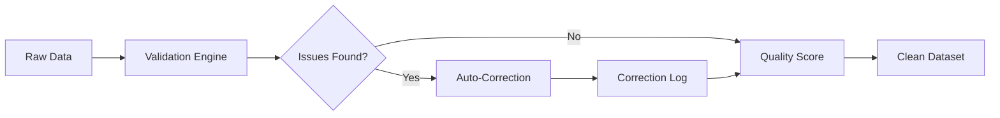
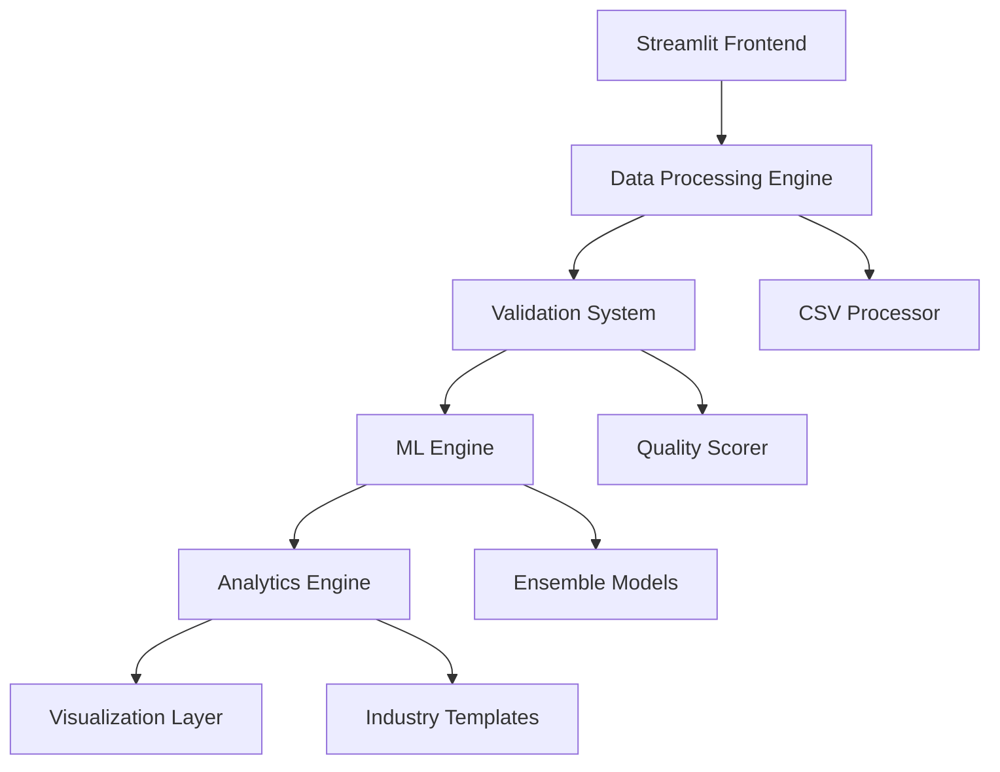

# 🚀 Advanced Financial Intelligence Platform (AIFI)

<div align="center">


[](https://python.org)
[](https://streamlit.io)
[](https://scikit-learn.org)
[](LICENSE)

**🎯 Transform Your Financial Data Into Strategic Intelligence**

*Empowering businesses with AI-driven analytics, automated validation, and industry benchmarking*

</div>

---

## 📋 Table of Contents

- [✨ Overview](#-overview)
- [🌟 Key Features](#-key-features)
- [🎨 Aesthetic Interface](#-aesthetic-interface)
- [🚀 Quick Start](#-quick-start)
- [📊 Data Validation Engine](#-data-validation-engine)
- [🤖 AI & Machine Learning](#-ai--machine-learning)
- [📈 Advanced Analytics](#-advanced-analytics)
- [🎯 Scenario Planning](#-scenario-planning)
- [⚠️ Risk Management](#️-risk-management)
- [🏭 Industry Intelligence](#-industry-intelligence)
- [📁 Data Requirements](#-data-requirements)
- [🛠️ Installation](#️-installation)
- [📖 Usage Guide](#-usage-guide)
- [🔧 Configuration](#-configuration)
- [📸 Screenshots](#-screenshots)
- [🤝 Contributing](#-contributing)
- [📜 License](#-license)
- [👥 Authors](#-authors)

---

## ✨ Overview

**AIFI (Advanced Financial Intelligence Platform)** represents the next evolution in financial analytics and business intelligence. Built for modern enterprises, consultants, and finance professionals, AIFI transforms raw financial data into actionable insights through cutting-edge AI, automated validation, and comprehensive industry benchmarking.

### 🎯 Mission Statement

*"To democratize advanced financial analytics by providing enterprise-grade intelligence tools that are accessible, accurate, and aesthetically designed for professionals who demand excellence."*

### 🌍 Target Audience

- **Finance Directors & CFOs** seeking comprehensive dashboards
- **Business Analysts** requiring data validation and insights
- **Consultants** needing industry benchmarking capabilities
- **Startups & SMEs** wanting enterprise-level analytics
- **Investment Professionals** analyzing portfolio companies

---

## 🌟 Key Features

### 🔍 Intelligent Data Processing
<table>
<tr>
<td width="50%">

**🎯 Smart CSV Import**
- Auto-detection of 20+ financial columns
- Intelligent mapping algorithms
- Real-time data preview
- Multi-format support

**🛡️ Advanced Validation**
- Accounting equation verification
- Profit logic consistency checks
- Statistical outlier detection
- Extreme variation analysis

</td>
<td width="50%">

**🔧 Automated Corrections**
- IQR-based outlier correction
- Linear interpolation for gaps
- Savitzky-Golay smoothing
- Transparent correction logging

**📊 Quality Scoring**
- Real-time quality metrics (0-100)
- Confidence level indicators
- Critical issue alerting
- Data reliability assessment

</td>
</tr>
</table>

### 🧠 AI-Powered Analytics
<table>
<tr>
<td width="50%">

**🤖 Machine Learning Suite**
- Ensemble forecasting models
- Random Forest + Linear + Ridge
- Cross-validation optimization
- Feature importance analysis

**📈 Predictive Intelligence**
- 3-36 month forecasting
- Confidence interval bands
- Scenario-based projections
- External factor integration

</td>
<td width="50%">

**🎯 Smart Recommendations**
- Priority-based action items
- Industry-specific insights
- ROI impact estimation
- Implementation timelines

**📊 Advanced Visualizations**
- Interactive Plotly charts
- Real-time KPI dashboards
- Risk heat maps
- Performance radars

</td>
</tr>
</table>

### 🏭 Industry Intelligence
<table>
<tr>
<td width="50%">

**🔍 Sector Analysis**
- SaaS, Retail, Tech, Manufacturing
- Auto-industry detection
- Comprehensive benchmarking
- Competitive positioning

**📋 Performance Templates**
- Industry-specific KPIs
- Standard ratio frameworks
- Seasonal factor modeling
- Working capital optimization

</td>
<td width="50%">

**🎯 Strategic Planning**
- Monte Carlo simulations
- Risk scenario modeling
- Business constraint application
- Multi-scenario comparisons

**💡 Actionable Insights**
- Sector-specific recommendations
- Best practice frameworks
- Performance gap analysis
- Strategic roadmaps

</td>
</tr>
</table>

---

## 🎨 Aesthetic Interface

### 🖥️ Modern Design Philosophy

AIFI embraces a **clean, professional, and intuitive** design language that enhances user experience while maintaining functional depth.

#### 🎨 Visual Elements
- **Color-Coded Metrics**: Instant visual feedback with semantic colors
- **Professional Icons**: Font Awesome and custom emoji iconography
- **Responsive Layout**: Optimized for all screen sizes
- **Interactive Components**: Hover effects, smooth transitions, expandable sections

#### 📊 Dashboard Features
- **Executive Summary Cards**: Key metrics at a glance
- **Progressive Disclosure**: Details available on-demand
- **Contextual Help**: Inline tooltips and guidance
- **Status Indicators**: Real-time system and data health

### 🎯 User Experience Highlights

```
🟢 Excellent    🔵 Good    🟡 Moderate    🔴 Critical
```

- **Intuitive Navigation**: Sidebar menu with clear categorization
- **Smart Defaults**: Pre-configured settings for immediate productivity
- **Contextual Feedback**: Instant validation and suggestion tooltips
- **Export Ready**: Professional-grade outputs for presentations

---

## 🚀 Quick Start

### ⚡ 5-Minute Setup

```bash
# 1. Clone the repository
git clone https://github.com/SalianiBouchaib/aifi.git
cd aifi

# 2. Install dependencies
pip install streamlit pandas numpy plotly scikit-learn scipy

# 3. Launch the application
streamlit run aifi.py

# 4. Open your browser to http://localhost:8501
```

### 🎯 First Steps

1. **📤 Upload Your Data**: Use the "Import CSV Intelligent" module
2. **👔 Review Dashboard**: Check the "Executive Dashboard" for immediate insights
3. **🧠 Explore Analytics**: Dive into advanced analytics and ML forecasting
4. **🎯 Plan Scenarios**: Use scenario planning for strategic decisions
5. **🏭 Benchmark Industry**: Compare against sector standards

---

## 📊 Data Validation Engine

### 🛡️ Comprehensive Validation Framework

AIFI's validation engine ensures data integrity through multiple layers of analysis:

#### 🔍 Core Validation Rules

<table>
<tr>
<th>Validation Type</th>
<th>Description</th>
<th>Action</th>
</tr>
<tr>
<td>🏦 <strong>Accounting Equation</strong></td>
<td>Assets = Liabilities + Equity</td>
<td>Flag violations > 5% tolerance</td>
</tr>
<tr>
<td>💰 <strong>Profit Logic</strong></td>
<td>Profit = Revenue - Costs</td>
<td>Identify calculation inconsistencies</td>
</tr>
<tr>
<td>📈 <strong>Extreme Variations</strong></td>
<td>Period-to-period changes > 100%</td>
<td>Smooth using Savitzky-Golay filter</td>
</tr>
<tr>
<td>📊 <strong>Statistical Outliers</strong></td>
<td>Values > 3σ from mean</td>
<td>Replace with IQR-based corrections</td>
</tr>
</table>

#### 🔧 Automated Correction Pipeline



### 📋 Quality Scoring Matrix

| Score Range | Quality Level | Confidence | Actions Required |
|-------------|---------------|------------|------------------|
| 90-100 | 🟢 Excellent | Very High | None - Proceed with analysis |
| 70-89 | 🔵 Good | High | Monitor for improvements |
| 50-69 | 🟡 Moderate | Medium | Review processes, validate externally |
| 0-49 | 🔴 Poor | Low | Immediate data quality improvement |

---

## 🤖 AI & Machine Learning

### 🧠 Ensemble Learning Architecture

AIFI employs sophisticated ensemble methods for robust predictions:

#### 🔬 Model Portfolio

<table>
<tr>
<td width="25%">

**🌳 Random Forest**
- Non-linear pattern detection
- Feature importance ranking
- Overfitting resistance
- High accuracy for complex data

</td>
<td width="25%">

**📈 Linear Models**
- Trend identification
- Interpretable coefficients
- Fast computation
- Baseline performance

</td>
<td width="25%">

**🔄 Ridge Regression**
- Regularization benefits
- Multicollinearity handling
- Stable predictions
- Noise reduction

</td>
<td width="25%">

**🎯 Voting Ensemble**
- Combines all models
- Weighted predictions
- Reduced variance
- Optimal performance

</td>
</tr>
</table>

#### 📊 Feature Engineering Pipeline

```python
# Automated feature creation
features = [
    "lag_1",              # Previous period value
    "lag_2",              # Two periods ago
    "trend",              # Linear trend component
    "seasonal",           # Seasonal patterns
    "moving_average_3",   # 3-period MA
    "volatility"          # Recent volatility
]
```

### 🎯 Performance Metrics

- **R² Score**: Model accuracy (0-1, higher is better)
- **RMSE**: Prediction error magnitude
- **MAE**: Average absolute error
- **Cross-Validation**: Out-of-sample reliability

---

## 📈 Advanced Analytics

### 📊 Comprehensive Ratio Analysis

#### 💧 Liquidity Ratios
- **Current Ratio**: Current Assets ÷ Current Liabilities
- **Quick Ratio**: (Current Assets - Inventory) ÷ Current Liabilities  
- **Cash Ratio**: Cash ÷ Current Liabilities

#### 💰 Profitability Ratios
- **Gross Margin**: (Revenue - COGS) ÷ Revenue
- **Operating Margin**: Operating Income ÷ Revenue
- **Net Margin**: Net Income ÷ Revenue
- **ROA**: Net Income ÷ Total Assets
- **ROE**: Net Income ÷ Shareholders' Equity

#### ⚡ Efficiency Ratios
- **Asset Turnover**: Revenue ÷ Total Assets
- **Inventory Turnover**: COGS ÷ Average Inventory
- **Receivables Turnover**: Revenue ÷ Average A/R

#### 🏗️ Leverage Ratios
- **Debt-to-Equity**: Total Debt ÷ Total Equity
- **Debt-to-Assets**: Total Debt ÷ Total Assets
- **Interest Coverage**: EBIT ÷ Interest Expense

### 🎯 Financial Health Scoring

The proprietary health score algorithm weighs multiple factors:

```
Health Score = (Liquidity × 0.3) + (Profitability × 0.4) + 
               (Efficiency × 0.2) + (Leverage × 0.1)
```

Adjusted for data quality and industry benchmarks.

---

## 🎯 Scenario Planning

### 🎲 Monte Carlo Simulation Engine

AIFI's scenario planning leverages advanced statistical modeling:

#### 📊 Scenario Framework

<table>
<tr>
<th>Scenario</th>
<th>Revenue Change</th>
<th>Cost Change</th>
<th>Probability</th>
<th>Use Case</th>
</tr>
<tr>
<td>🔴 <strong>Pessimistic</strong></td>
<td>-15% to -30%</td>
<td>+10% to +25%</td>
<td>20%</td>
<td>Recession, market downturn</td>
</tr>
<tr>
<td>🔵 <strong>Realistic</strong></td>
<td>-5% to +15%</td>
<td>+5% to +12%</td>
<td>60%</td>
<td>Normal business conditions</td>
</tr>
<tr>
<td>🟢 <strong>Optimistic</strong></td>
<td>+20% to +50%</td>
<td>+3% to +8%</td>
<td>20%</td>
<td>Market expansion, new products</td>
</tr>
</table>

#### 🔬 Auto-Calibration Features

- **Historical Volatility Analysis**: Uses your data patterns
- **Industry Seasonality**: Applies sector-specific cycles
- **Business Constraints**: Realistic growth/decline limits
- **External Factors**: Market and economic adjustments

### 📈 Simulation Outputs

- **Expected Value**: Probability-weighted outcome
- **Value at Risk (VaR)**: 5th and 1st percentile losses
- **Upside Potential**: 95th percentile gains
- **Risk-Reward Ratio**: Upside vs. downside analysis

---

## ⚠️ Risk Management

### 🛡️ Multi-Dimensional Risk Assessment

AIFI evaluates risk across six critical dimensions:

#### 📊 Risk Scoring Matrix

<table>
<tr>
<th>Risk Factor</th>
<th>Weight</th>
<th>Measurement</th>
<th>Critical Threshold</th>
</tr>
<tr>
<td>📈 <strong>Revenue Volatility</strong></td>
<td>30%</td>
<td>Coefficient of variation</td>
<td>>30%</td>
</tr>
<tr>
<td>💰 <strong>Profitability</strong></td>
<td>25%</td>
<td>Net margin trends</td>
<td><0%</td>
</tr>
<tr>
<td>📊 <strong>Growth Trend</strong></td>
<td>20%</td>
<td>Revenue growth rate</td>
<td><-20%</td>
</tr>
<tr>
<td>💧 <strong>Liquidity</strong></td>
<td>15%</td>
<td>Current ratio</td>
<td><0.8</td>
</tr>
<tr>
<td>🏗️ <strong>Leverage</strong></td>
<td>10%</td>
<td>Debt-to-equity ratio</td>
<td>>3.0</td>
</tr>
</table>

#### 🎯 Risk Mitigation Strategies

- **Critical Risk (75-100)**: Immediate intervention required
- **High Risk (50-74)**: Preventive actions needed
- **Moderate Risk (25-49)**: Regular monitoring
- **Low Risk (0-24)**: Maintain current practices

### 📊 Value at Risk (VaR) Analysis

```
VaR 5% = $X,XXX
Interpretation: 95% confidence that losses won't exceed $X,XXX
```

---

## 🏭 Industry Intelligence

### 🔍 Sector Specialization

AIFI provides deep insights across four major industries:

#### ☁️ SaaS (Software as a Service)

<table>
<tr>
<td width="50%">

**📊 Key Metrics**
- Monthly Recurring Revenue (MRR)
- Annual Recurring Revenue (ARR)
- Customer Lifetime Value (LTV)
- Customer Acquisition Cost (CAC)
- Churn Rate
- Net Revenue Retention

</td>
<td width="50%">

**📈 Benchmarks**
- Gross Margin: 80%+
- Net Margin: 15%+
- Growth Rate: 30%+
- Churn Rate: <5%
- LTV/CAC Ratio: >3:1

</td>
</tr>
</table>

#### 🛍️ Retail

<table>
<tr>
<td width="50%">

**📊 Key Metrics**
- Same-Store Sales Growth
- Inventory Turnover
- Gross Margin
- Sales per Square Foot
- Customer Traffic
- Average Transaction Value

</td>
<td width="50%">

**📈 Benchmarks**
- Gross Margin: 35%
- Net Margin: 4%
- Inventory Turns: 6x
- Growth Rate: 5%
- Current Ratio: 1.2

</td>
</tr>
</table>

#### 💻 Technology

<table>
<tr>
<td width="50%">

**📊 Key Metrics**
- R&D as % of Revenue
- Time to Market
- Product Margins
- Revenue per Employee
- Innovation Pipeline

</td>
<td width="50%">

**📈 Benchmarks**
- Gross Margin: 60%
- Net Margin: 12%
- R&D Ratio: 25%
- Growth Rate: 15%
- Asset Turnover: 0.8

</td>
</tr>
</table>

#### 🏭 Manufacturing

<table>
<tr>
<td width="50%">

**📊 Key Metrics**
- Capacity Utilization
- Overall Equipment Effectiveness (OEE)
- Quality Defect Rate
- Labor Productivity
- Supply Chain Efficiency

</td>
<td width="50%">

**📈 Benchmarks**
- Gross Margin: 25%
- Net Margin: 8%
- Capacity Utilization: 85%
- OEE: 75%
- Inventory Turns: 8x

</td>
</tr>
</table>

### 🎯 Auto-Detection Algorithm

AIFI automatically identifies your industry based on:
- Profit margin patterns
- Revenue volatility
- Seasonal factors
- Growth characteristics
- Cost structure analysis

---

## 📁 Data Requirements

### 📋 Supported File Formats

- **CSV Files**: UTF-8 encoded, comma-separated
- **Excel Integration**: Convert to CSV before import
- **Template Downloads**: Industry-specific templates available

### 📊 Required Columns

#### 🔥 Core Financial Data

<table>
<tr>
<th>Column Type</th>
<th>Examples</th>
<th>Required</th>
<th>Auto-Detection</th>
</tr>
<tr>
<td><strong>📅 Date</strong></td>
<td>Date, Month, Period</td>
<td>✅</td>
<td>✅</td>
</tr>
<tr>
<td><strong>💰 Revenue</strong></td>
<td>Revenue, Sales, Income</td>
<td>✅</td>
<td>✅</td>
</tr>
<tr>
<td><strong>💸 Costs</strong></td>
<td>Costs, Expenses, COGS</td>
<td>✅</td>
<td>✅</td>
</tr>
<tr>
<td><strong>📈 Profit</strong></td>
<td>Profit, Net Income, Earnings</td>
<td>🔵</td>
<td>✅</td>
</tr>
</table>

#### 📊 Optional Enrichment Data

<table>
<tr>
<th>Category</th>
<th>Columns</th>
<th>Benefits</th>
</tr>
<tr>
<td><strong>🏦 Balance Sheet</strong></td>
<td>Assets, Liabilities, Equity</td>
<td>Ratio analysis, financial health</td>
</tr>
<tr>
<td><strong>📦 Operations</strong></td>
<td>Inventory, A/R, A/P</td>
<td>Working capital optimization</td>
</tr>
<tr>
<td><strong>👥 Business</strong></td>
<td>Customers, Units, Pricing</td>
<td>Unit economics, scaling insights</td>
</tr>
</table>

### 📥 Example Data Structure

```csv
Date,Revenue,Costs,Profit,Assets,Liabilities,Equity,Customers
2025-01-01,15000,12000,3000,50000,20000,30000,150
2025-02-01,16500,13100,3400,52000,21000,31000,165
2025-03-01,14200,11800,2400,51500,20800,30700,158
```

---

## 🛠️ Installation

### 🔧 System Requirements

- **Python**: 3.8 or higher
- **RAM**: 4GB minimum, 8GB recommended
- **Storage**: 1GB free space
- **Browser**: Modern web browser (Chrome, Firefox, Safari, Edge)

### 📦 Dependencies

```txt
streamlit>=1.28.0
pandas>=1.5.0
numpy>=1.24.0
plotly>=5.15.0
scikit-learn>=1.3.0
scipy>=1.10.0
```

### ⚡ Installation Methods

#### 🚀 Quick Install (Recommended)

```bash
# Clone repository
git clone https://github.com/SalianiBouchaib/aifi.git
cd aifi

# Install with pip
pip install -r requirements.txt

# Launch application
streamlit run aifi.py
```

#### 🐳 Docker Installation

```dockerfile
FROM python:3.9-slim

WORKDIR /app
COPY . .
RUN pip install -r requirements.txt

EXPOSE 8501
CMD ["streamlit", "run", "aifi.py"]
```

```bash
# Build and run
docker build -t aifi .
docker run -p 8501:8501 aifi
```

#### 📱 Cloud Deployment

**Streamlit Cloud**
```bash
# Push to GitHub and deploy via streamlit.io
```

**Heroku**
```bash
# Add Procfile: web: streamlit run aifi.py --server.port=$PORT
```

---

## 📖 Usage Guide

### 🎯 Step-by-Step Workflow

#### 1. 📤 Data Import & Validation

```
📁 Upload CSV → 🔍 Auto-Mapping → 🛡️ Validation → 🔧 Corrections → ✅ Quality Score
```

1. **Upload Your File**: Drag & drop or browse CSV files
2. **Review Mapping**: Verify auto-detected columns
3. **Check Validation**: Review quality score and issues
4. **Apply Corrections**: Accept or modify automated fixes
5. **Confirm Quality**: Ensure >70% quality score for reliable analysis

#### 2. 👔 Executive Dashboard

```
📊 KPI Overview → 📈 Trend Analysis → 💡 AI Insights → ⚠️ Alert Review
```

- **Revenue Metrics**: Growth, volatility, trends
- **Profitability**: Margins, ratios, benchmarks  
- **Quality Indicators**: Data confidence, corrections applied
- **Action Items**: Prioritized recommendations

#### 3. 🧠 Advanced Analytics

```
📊 Ratio Analysis → 🏥 Health Score → 🏭 Benchmarking → 💡 Recommendations
```

- **Financial Ratios**: 15+ comprehensive ratios
- **Industry Comparison**: Multi-sector benchmarking
- **Health Scoring**: Aggregated performance metrics
- **AI Insights**: Machine learning-driven recommendations

#### 4. 🎯 Scenario Planning

```
📊 Base Data → ⚙️ Configure Scenarios → 🎲 Monte Carlo → 📈 Results Analysis
```

- **Auto-Calibration**: Historical pattern detection
- **Scenario Setup**: Pessimistic, realistic, optimistic
- **Simulation**: 1000+ Monte Carlo iterations
- **Risk Analysis**: VaR, probabilities, distributions

#### 5. 🤖 ML Forecasting

```
📊 Feature Engineering → 🧠 Model Training → 🔍 Validation → 📈 Predictions
```

- **Data Preparation**: Automated feature creation
- **Model Selection**: Ensemble algorithm optimization
- **Cross-Validation**: Out-of-sample testing
- **Forecast Generation**: 3-36 month predictions with confidence intervals

#### 6. ⚠️ Risk Management

```
📊 Risk Assessment → 🎲 Monte Carlo → 📈 VaR Calculation → 💡 Mitigation Plans
```

- **Multi-Dimensional Analysis**: 6 risk factors
- **Risk Scoring**: 0-100 composite score
- **Scenario Simulation**: Thousands of risk outcomes
- **Action Plans**: Prioritized risk mitigation strategies

### 🎨 Interface Navigation

#### 📱 Sidebar Menu

```
📤 Import CSV Intelligent     - Data upload and validation
👔 Dashboard Exécutif         - Executive KPI overview  
🧠 Analytics IA Avancés       - Advanced ratio analysis
🎯 Planification Scénarios    - Monte Carlo scenarios
🤖 Prévisions ML Optimisées   - Machine learning forecasts
⚠️ Gestion Risques Avancée   - Risk assessment and mitigation
🏭 Templates Sectoriels       - Industry benchmarking
```

#### 🎯 Main Content Areas

- **Header**: Current module title and data quality status
- **Metrics Cards**: Key performance indicators
- **Visualizations**: Interactive Plotly charts
- **Tables**: Detailed data and comparisons
- **Insights**: AI-generated recommendations
- **Controls**: Configuration and export options

---

## 🔧 Configuration

### ⚙️ Customization Options

#### 📊 Data Processing

```python
# Validation thresholds
OUTLIER_THRESHOLD = 3.0        # Standard deviations
VARIATION_THRESHOLD = 1.0      # 100% change limit
CONFIDENCE_LEVEL = 95          # Forecast confidence

# Quality scoring weights
WEIGHTS = {
    'liquidity': 0.3,
    'profitability': 0.4, 
    'efficiency': 0.2,
    'leverage': 0.1
}
```

#### 🎨 Interface Customization

```python
# Currency and formatting
USER_PREFERENCES = {
    'currency': 'DHS',           # Display currency
    'date_format': 'YYYY-MM-DD', # Date format
    'decimal_places': 2,         # Precision
    'theme': 'light'            # UI theme
}
```

#### 🏭 Industry Settings

```python
# Custom industry benchmarks
CUSTOM_BENCHMARKS = {
    'my_industry': {
        'net_margin': 0.12,
        'current_ratio': 1.8,
        'growth_rate': 0.25
    }
}
```

### 🔐 Security Configuration

```python
# Data handling
LOCAL_PROCESSING = True        # Keep data local
SESSION_CLEANUP = True         # Clear session data
ENCRYPTION = False            # Enable for sensitive data
```

---

## 📸 Screenshots

### 🖥️ Executive Dashboard

*Comprehensive KPI overview with quality indicators*

### 📊 Advanced Analytics
 
*Financial ratios, health scoring, and benchmarking*

### 🎯 Scenario Planning

*Monte Carlo simulations with risk analysis*

### 🤖 ML Forecasting

*Ensemble model predictions with confidence intervals*

### 🏭 Industry Templates

*Sector-specific benchmarking and insights*

---

## 🔍 Technical Architecture

### 🏗️ System Components



### 📦 Core Modules

<table>
<tr>
<th>Module</th>
<th>Purpose</th>
<th>Key Classes</th>
</tr>
<tr>
<td><strong>Data Validation</strong></td>
<td>Quality assurance and correction</td>
<td>AdvancedDataValidator</td>
</tr>
<tr>
<td><strong>ML Engine</strong></td>
<td>Forecasting and predictions</td>
<td>EnhancedMLForecastingEngine</td>
</tr>
<tr>
<td><strong>Analytics</strong></td>
<td>Financial analysis and ratios</td>
<td>AdvancedAnalytics</td>
</tr>
<tr>
<td><strong>Scenarios</strong></td>
<td>Monte Carlo simulations</td>
<td>EnhancedScenarioCalibrator</td>
</tr>
<tr>
<td><strong>Industry</strong></td>
<td>Sector-specific intelligence</td>
<td>IndustryTemplateManager</td>
</tr>
</table>

### ⚡ Performance Optimizations

- **Caching**: Session state management for large datasets
- **Lazy Loading**: Progressive data processing
- **Vectorization**: NumPy operations for speed
- **Memory Management**: Efficient data structures

---

## 🤝 Contributing

### 🌟 Ways to Contribute

We welcome contributions from the community! Here's how you can help:

#### 🐛 Bug Reports
```bash
# Use GitHub Issues with template
- Detailed description
- Steps to reproduce
- Expected vs actual behavior
- System information
```

#### 🚀 Feature Requests
```bash
# Enhancement proposals
- Use case description
- Proposed solution
- Implementation considerations
- User impact assessment
```

#### 💻 Code Contributions

```bash
# Development workflow
1. Fork the repository
2. Create feature branch: git checkout -b feature/amazing-feature
3. Commit changes: git commit -m 'Add amazing feature'
4. Push to branch: git push origin feature/amazing-feature
5. Open Pull Request
```

### 📋 Development Guidelines

#### 🎯 Code Standards
- **Python**: Follow PEP 8 style guide
- **Documentation**: Comprehensive docstrings
- **Testing**: Unit tests for core functions
- **Performance**: Efficient algorithms and data structures

#### 🔧 Development Setup

```bash
# Development environment
git clone https://github.com/SalianiBouchaib/aifi.git
cd aifi

# Install development dependencies
pip install -r requirements-dev.txt

# Run tests
pytest tests/

# Start development server
streamlit run aifi.py --server.runOnSave true
```

### 🏆 Recognition

Contributors will be recognized in:
- README.md contributors section
- GitHub releases changelog
- Application about page

---

## 📊 Roadmap

### 🚀 Version 2.0 Features

#### 🤖 Advanced AI
- [ ] GPT integration for natural language insights
- [ ] Automated report generation
- [ ] Voice-activated analytics
- [ ] Predictive anomaly detection

#### 📊 Enhanced Analytics  
- [ ] Real-time data streaming
- [ ] Multi-company comparisons
- [ ] ESG scoring integration
- [ ] Blockchain audit trails

#### 🌐 Platform Expansion
- [ ] Mobile app development
- [ ] API endpoints for integration
- [ ] Cloud-native deployment
- [ ] Enterprise SSO support

#### 🏭 Industry Expansion
- [ ] Healthcare & Pharma templates
- [ ] Financial services modules
- [ ] Real estate analytics
- [ ] Energy sector intelligence

### 📅 Release Timeline

```
Q1 2024: Mobile responsiveness, API foundation
Q2 2024: Advanced ML models, real-time features  
Q3 2024: Industry expansion, cloud deployment
Q4 2024: Enterprise features, integrations
```

---

## 📜 License

### MIT License

```
Copyright (c) 2024 SalianiBouchaib

Permission is hereby granted, free of charge, to any person obtaining a copy
of this software and associated documentation files (the "Software"), to deal
in the Software without restriction, including without limitation the rights
to use, copy, modify, merge, publish, distribute, sublicense, and/or sell
copies of the Software, and to permit persons to whom the Software is
furnished to do so, subject to the following conditions:

The above copyright notice and this permission notice shall be included in all
copies or substantial portions of the Software.

THE SOFTWARE IS PROVIDED "AS IS", WITHOUT WARRANTY OF ANY KIND, EXPRESS OR
IMPLIED, INCLUDING BUT NOT LIMITED TO THE WARRANTIES OF MERCHANTABILITY,
FITNESS FOR A PARTICULAR PURPOSE AND NONINFRINGEMENT. IN NO EVENT SHALL THE
AUTHORS OR COPYRIGHT HOLDERS BE LIABLE FOR ANY CLAIM, DAMAGES OR OTHER
LIABILITY, WHETHER IN AN ACTION OF CONTRACT, TORT OR OTHERWISE, ARISING FROM,
OUT OF OR IN CONNECTION WITH THE SOFTWARE OR THE USE OR OTHER DEALINGS IN THE
SOFTWARE.
```

---

## 👥 Authors

### 🎯 Project Lead

<div align="center">


**[SalianiBouchaib](https://github.com/SalianiBouchaib)**  
*Principal Developer & Product Architect*

[](https://github.com/SalianiBouchaib)
[](https://linkedin.com/in/salianibouchaib)

</div>

### 🌟 Core Philosophy

*"Building intelligent financial tools that democratize enterprise-grade analytics for businesses of all sizes, while maintaining the highest standards of accuracy, usability, and aesthetic design."*

### 📫 Contact & Support

<table align="center">
<tr>
<td align="center">

**🐛 Bug Reports**  
[GitHub Issues](https://github.com/SalianiBouchaib/aifi/issues)

</td>
<td align="center">

**💡 Feature Requests**  
[GitHub Discussions](https://github.com/SalianiBouchaib/aifi/discussions)

</td>
<td align="center">

**📧 Direct Contact**  
[Email Support](mailto:support@aifi.app)

</td>
</tr>
</table>

---

## 🎉 Acknowledgments

### 🙏 Special Thanks

- **Streamlit Team**: For the amazing framework that powers our UI
- **Plotly**: For beautiful, interactive visualizations
- **Scikit-learn**: For robust machine learning capabilities
- **Open Source Community**: For the countless libraries that make AIFI possible

### 📚 Inspiration & References

- **Corporate Finance Principles**: Ross, Westerfield & Jaffe
- **Financial Statement Analysis**: Martin Fridson & Fernando Alvarez  
- **Machine Learning**: Andrew Ng's coursework and methodologies
- **Risk Management**: CFA Institute standards and practices

---

## 🎯 Final Words

<div align="center">

### 🚀 Transform Your Financial Analysis Today

**AIFI represents the future of financial intelligence—where advanced analytics meets intuitive design, where AI-powered insights drive strategic decisions, and where professional-grade tools are accessible to businesses of all sizes.**

---

*Built with ❤️ by financial professionals, for financial professionals*

**[⭐ Star this repository](https://github.com/SalianiBouchaib/aifi) | [🍴 Fork for your needs](https://github.com/SalianiBouchaib/aifi/fork) | [📊 Start analyzing now](https://github.com/SalianiBouchaib/aifi)**

---


*Empowering financial excellence through intelligent automation*

</div>

---

<div align="center">
<sub>Last updated: October 2024 | Version 1.0.0 | Made with Streamlit</sub>
</div>
